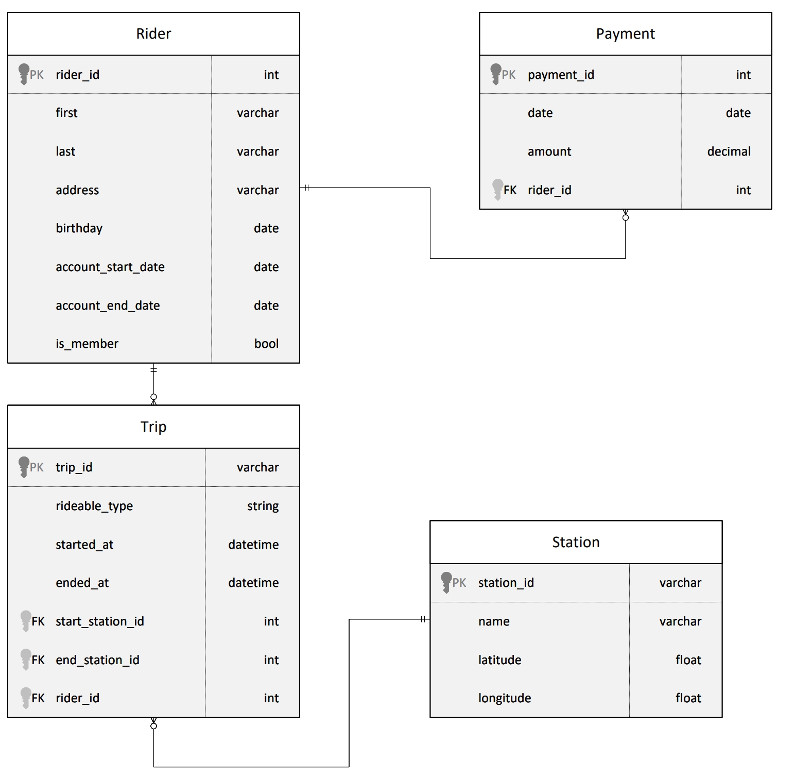
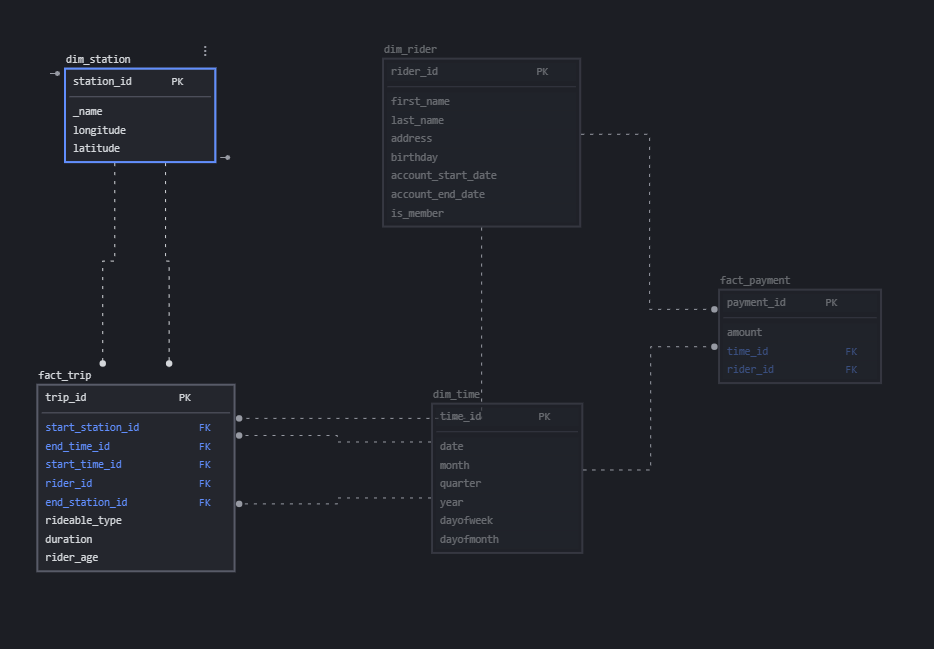
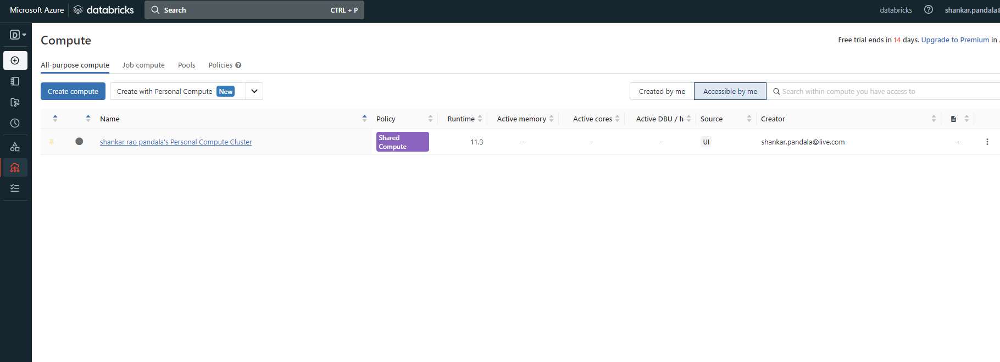
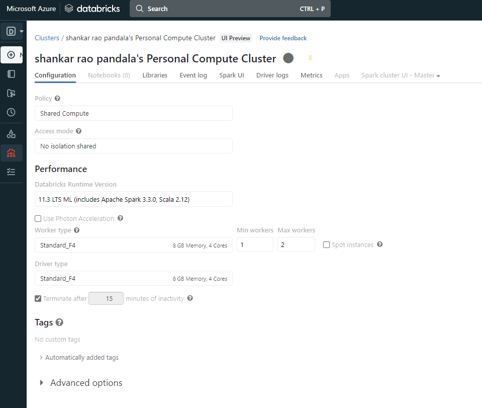
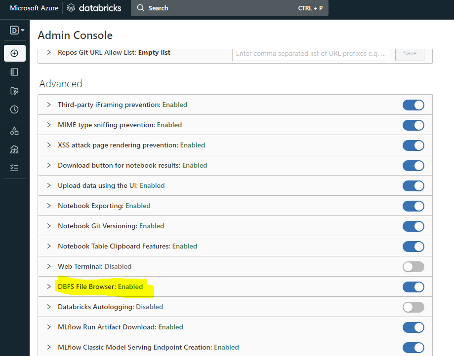
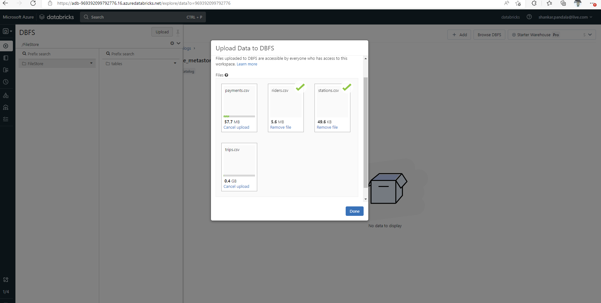
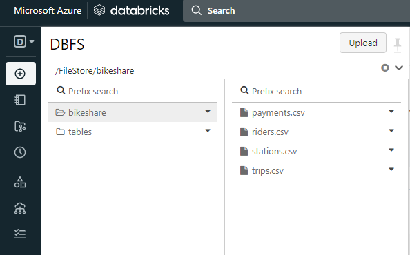
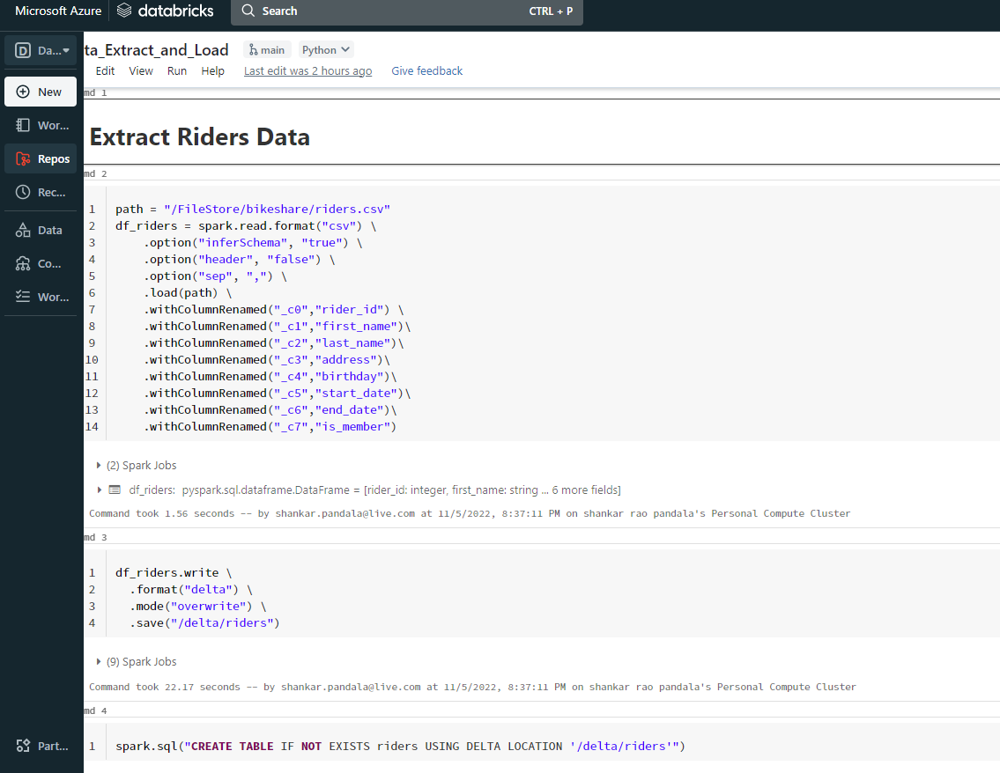
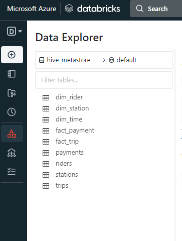

# datalake-for-bikeshareanalytics
Building an Azure Data Lake for Bike Share Data Analytics as part of Udacity Shell Nanodegree Scholarship program

Divvy is a bike sharing program in Chicago, Illinois USA that allows riders to purchase a pass at a kiosk or use a mobile application to unlock a bike at stations around the city and use the bike for a specified amount of time. The bikes can be returned to the same station or to another station. The City of Chicago makes the anonymized bike trip data publicly available for projects like this where we can analyze the data.

**ERD for Divvy Bikeshare Dataset**

The goal of this project is to develop a data lake solution using **Azure Databricks** using a lake house architecture. We will:

- Design a star schema based on the business outcomes listed below;
- Import the data into Azure Databricks using Delta Lake to create a Bronze data store;
- Create a gold data store in Delta Lake tables;
- Transform the data into the star schema for a Gold data store;

The business outcomes we are designing for are as follows:
1. Analyze how much time is spent per ride
- Based on date and time factors such as day of week and time of day
- Based on which station is the starting and / or ending station
- Based on age of the rider at time of the ride
- Based on whether the rider is a member or a casual rider
2. Analyze how much money is spent
- Per month, quarter, year
- Per member, based on the age of the rider at account start
3. Analyze how much money is spent per member
- Based on how many rides the rider averages per month
- Based on how many minutes the rider spends on a bike per month

# Star Schema Design

Below is the star schema design for the project :

# Steps To Reproduce The project

## Step 1 : Create resources

1. Create an **Azure Databricks Workspace**

2. Create a **Spark Cluster** inside the **Databricks Workspace**.
The real power of Databricks comes from the Apache Spark compute power available on-demand from Azure.
To add and monitor the Apache Spark compute power associated with our workspace, we access the Computer node from the main Databricks workspace menu. Select **Compute** tab and hit  **Create Cluster**:

3. Enable DBFS from the admin console

## Step 2 : Ingest Data into Azure Databricks

1. Go to **Data** tab and upload your data files to *FileStore/tables*

2. files uploaded to the filestore

## Step 3 : ELT on Notebook

1. Go to **Workspace** tab and create notebook. Make sure you choose the right cluster.

2. Create dataframes for all four files riders, stations, payments and trips.

3. Write all your data out to delta

